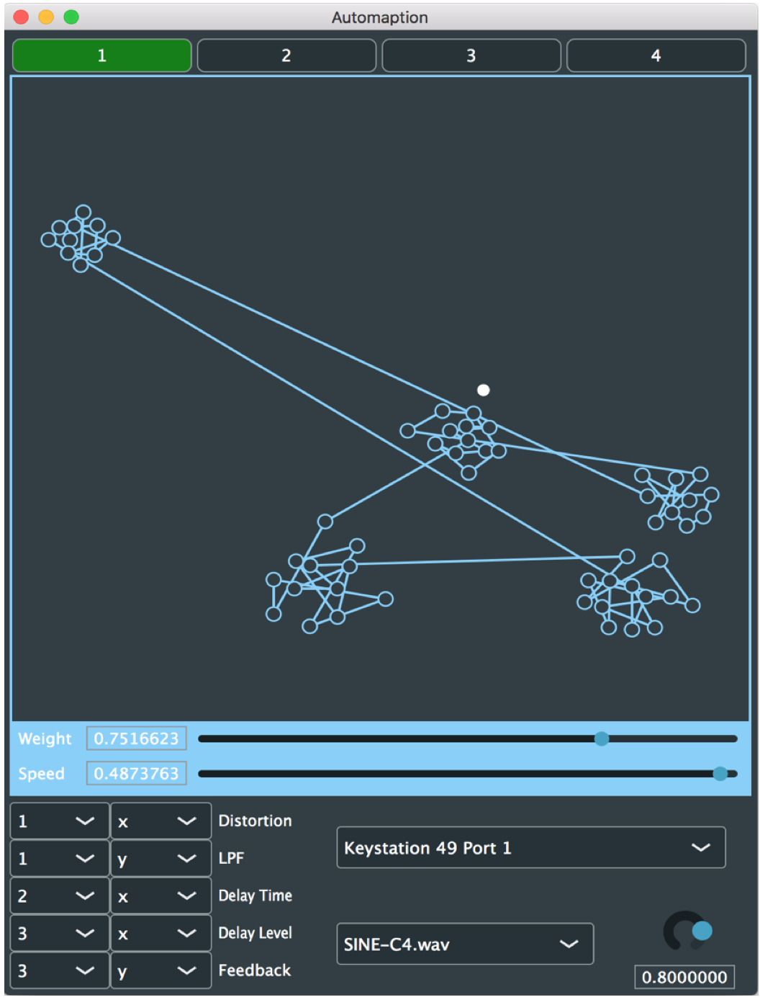
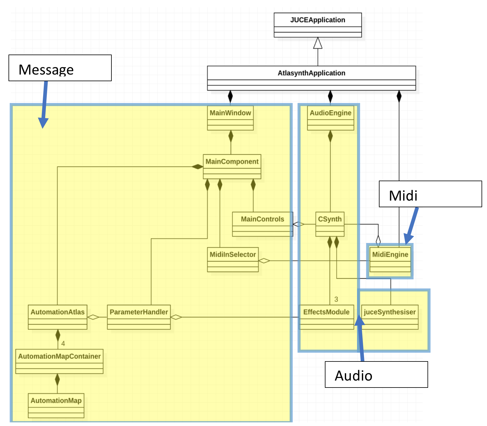

# Automaption

A great and amazing standalone synthesiser coded in C++ with JUCE

Draw shapes and have the marker follow the outline (roughly) - which in turn controls up to two parameters based on the marker's location.

In use:\
\

Class relationship diagram:\

